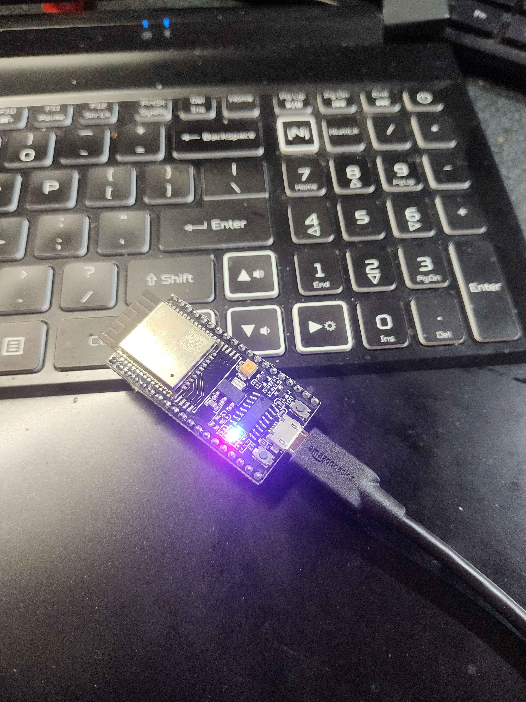

# SunFounder ESP32 Ultimate Starter Kit Projects


Welcome to my collection of projects built using the **SunFounder ESP32 Ultimate Starter Kit**! This repository includes various projects demonstrating the functionality of ESP32 with multiple components included in the kit. Each project section includes an overview, setup instructions, and visuals.

---

## Table of Contents
- [Overview](#overview)
- [Kit Projects](#kit-projects)
  - [1. LED Blink](#1-led-blink)
  - [2. Button Controlled LED](#2-button-controlled-led)
  - [3. RGB LED Control](#3-rgb-led-control)
  - [4. Temperature and Humidity Monitor](#4-temperature-and-humidity-monitor)
  - [5. Motion Detection](#5-motion-detection)
  - [6. Light Intensity Sensor](#6-light-intensity-sensor)
  - [7. Sound Detection](#7-sound-detection)
  - [8. Servo Motor Control](#8-servo-motor-control)
  - [9. Ultrasonic Distance Sensor](#9-ultrasonic-distance-sensor)
  - [10. OLED Display](#10-oled-display)
  - [11. Wi-Fi Controlled Device](#11-wi-fi-controlled-device)
  - [12. Bluetooth Communication](#12-bluetooth-communication)
  - [13. Real-Time Clock Display](#13-real-time-clock-display)
  - [14. Infrared Remote Control](#14-infrared-remote-control)
  - [15. Smart Home Automation](#15-smart-home-automation)
- [Installation](#installation)
- [Usage](#usage)
- [Acknowledgements](#acknowledgements)

---

## Overview
This README covers projects created using the SunFounder ESP32 Ultimate Starter Kit. Each project demonstrates key functionality and serves as a stepping stone in learning how to use various sensors, actuators, and communication modules with the ESP32.

---

## Kit Projects

### 1. LED Blink
This is a basic project to make an LED blink using the ESP32.

- **Components**: LED, Resistor
- **Code**: [LED Blink Code](./code/led_blink.ino)
- **Demo**: 

---

### 2. Button Controlled LED
Control an LED with a button, demonstrating basic input/output functions.

- **Components**: LED, Button, Resistor
- **Code**: [Button Controlled LED Code](./code/button_led.ino)
- **Demo**: 

---

### 3. RGB LED Control
Control an RGB LED’s colors through the ESP32.

- **Components**: RGB LED, Resistors
- **Code**: [RGB LED Control Code](./code/rgb_led.ino)
- **Demo**: 

---

### 4. Temperature and Humidity Monitor
Monitor temperature and humidity using the DHT11 sensor.

- **Components**: DHT11 Temperature & Humidity Sensor
- **Code**: [Temp & Humidity Code](./code/temp_humidity.ino)
- **Demo**: 

---

### 5. Motion Detection
Detect motion using the PIR sensor and trigger actions.

- **Components**: PIR Motion Sensor
- **Code**: [Motion Detection Code](./code/motion_detection.ino)
- **Demo**: 

---

### 6. Light Intensity Sensor
Measure light levels using an LDR (light-dependent resistor).

- **Components**: LDR, Resistor
- **Code**: [Light Sensor Code](./code/light_sensor.ino)
- **Demo**: 

---

### 7. Sound Detection
Detect sound and display levels on the ESP32.

- **Components**: Microphone Sound Sensor
- **Code**: [Sound Detection Code](./code/sound_detection.ino)
- **Demo**: 

---

### 8. Servo Motor Control
Control a servo motor’s angle using the ESP32.

- **Components**: Servo Motor
- **Code**: [Servo Control Code](./code/servo_control.ino)
- **Demo**: 

---

### 9. Ultrasonic Distance Sensor
Measure distance using the ultrasonic sensor.

- **Components**: Ultrasonic Sensor
- **Code**: [Distance Sensor Code](./code/distance_sensor.ino)
- **Demo**: 

---

### 10. OLED Display
Display data on a small OLED screen connected to the ESP32.

- **Components**: OLED Display
- **Code**: [OLED Display Code](./code/oled_display.ino)
- **Demo**: 

---

### 11. Wi-Fi Controlled Device
Control the ESP32 over Wi-Fi to switch devices on or off.

- **Components**: Wi-Fi Module (built-in ESP32), Relays
- **Code**: [Wi-Fi Control Code](./code/wifi_control.ino)
- **Demo**: 

---

### 12. Bluetooth Communication
Use Bluetooth to send and receive data between the ESP32 and a mobile device.

- **Components**: ESP32 (built-in Bluetooth)
- **Code**: [Bluetooth Code](./code/bluetooth.ino)
- **Demo**: 

---

### 13. Real-Time Clock Display
Show the current date and time on the OLED display using a real-time clock module.

- **Components**: RTC Module, OLED Display
- **Code**: [RTC Display Code](./code/rtc_display.ino)
- **Demo**: 

---

### 14. Infrared Remote Control
Control devices with an infrared remote and receiver.

- **Components**: IR Receiver Module
- **Code**: [IR Remote Code](./code/ir_remote.ino)
- **Demo**: 

---

### 15. Smart Home Automation
Create a basic smart home automation setup using relays and sensors.

- **Components**: Relays, Sensors
- **Code**: [Smart Home Code](./code/smart_home.ino)
- **Demo**: 

---

## Installation

1. **Clone this Repository**:
   ```bash
   git clone https://github.com/yourusername/ESP32-Starter-Kit-Projects.git
